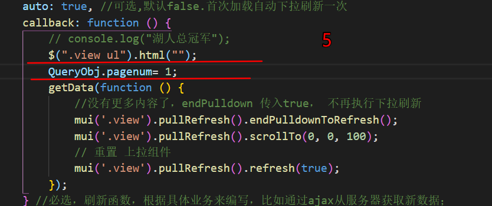
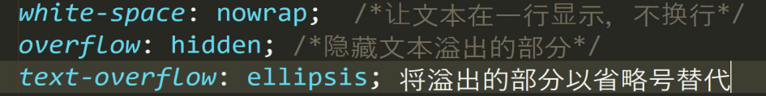
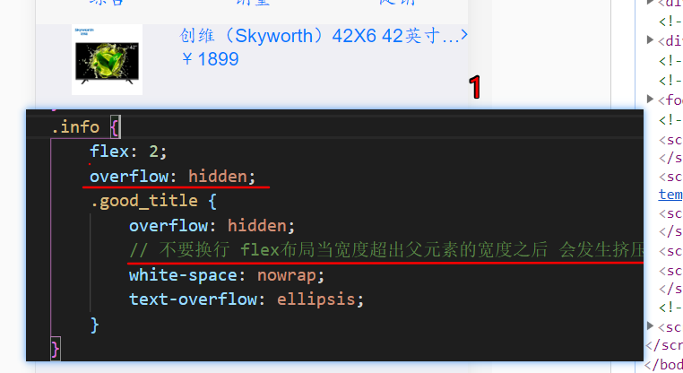
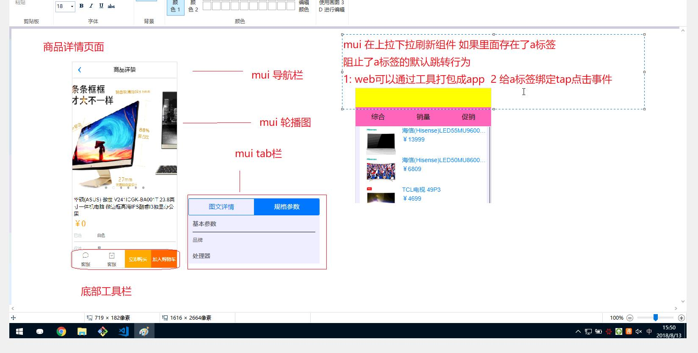
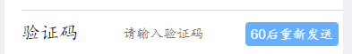
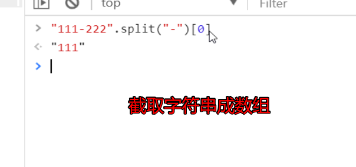
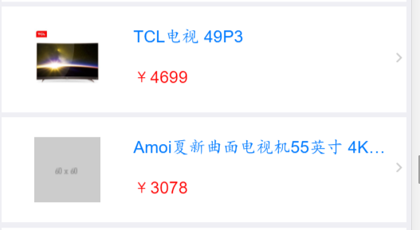

# 项目介绍

目录

[1  项目背景](#1--项目背景)

[2  架构介绍](#2--架构介绍)

[3  技术在线](#3--技术在线)

**重点技术**

- [4.1  mui轮播图](#41--mui轮播图)
- [4.2  代码优化之--拦截器](#42--代码优化之--拦截器)
- [4.7  根据url上的key来取值](#47--根据url上的key来取值)
- [5.0  拓展zepto](#50--拓展zepto)
- [5.5  解决MUI阻止a标签默认跳转事件](#55--解决mui阻止a标签默认跳转事件)
- [5.8  Zepto picLazyLoad Plugin，图片懒加载的Zepto插件](#58--zepto-piclazyload-plugin图片懒加载的zepto插件)

[4  技术详解](#4--技术详解)

- [4.3  模板引擎](https://github.com/BryantOut/bx#1--%E6%A8%A1%E6%9D%BF%E5%BC%95%E6%93%8E%E7%9A%84%E4%BD%BF%E7%94%A8)
- [4.4  rem](https://github.com/BryantOut/rem-learning)
- [4.5  mui上拉刷新下拉加载](#45--mui上拉刷新下拉加载)
- [4.6  处理文本溢出](#46--处理文本溢出)
- [4.7  根据url上的key来取值](#47--根据url上的key来取值)
- [4.8  模板引擎中的变量](https://github.com/BryantOut/bx#12--%E6%A8%A1%E6%9D%BF%E5%BC%95%E6%93%8E%E4%B8%AD%E7%9A%84%E5%8F%98%E9%87%8F)
- [4.9  关于拦截器](#49--关于拦截器)
- [5.1  重置宽度（小知识）](#51--重置宽度小知识)
- [5.2  在js中打断点](#52--在js中打断点)
- [5.3  链式编程（小复习）](#53--链式编程小复习)
- [5.4  表单标签选择](#54--表单标签选择)
- [5.6  简单实现倒计时](#56--简单实现倒计时)
- [5.7  根据指定字符截取字符串成数组](#57--根据指定字符截取字符串成数组)

## 1  项目背景

​	品优购网上商城是一个综合性的**B2B2C**平台，类似京东商城，

天猫商城。网站采用商家入驻的模式，商家入驻平台提交申请，有平台资质审核，审核过后，商家拥有独立管理后台，录入商品信息。商品经过平台审核后即可发布。

​	品优购网上商城主要分为网站前台，运营商、商家管理后台三个子系统。

> **B2B2C**

​	B2B2C是一种电子商务类型的[网络购物](https://baike.baidu.com/item/%E7%BD%91%E7%BB%9C%E8%B4%AD%E7%89%A9/1521810)商业模式，B是BUSINESS的简称，C是CUSTOMER的简称，第一个B指的是商品或服务的供应商，第二个B指的是从事电子商务的企业，C则是表示消费者。

## 2  架构介绍

​	目前企业中开发的项目，大部分是使用前后端分离的架构。

如图：


## 3  技术在线


​	可能需要用得到的网站

| 名称           | 网址                                       | 备注          |
| ------------ | ---------------------------------------- | ----------- |
| zepto        | http://www.css88.com/doc/zeptojs_api/    | zepto的中文api |
| art-template | http://aui.github.io/art-template/zh-cn/docs/ | 模版引擎        |
| fontawesome  | http://fontawesome.dashgame.com/         | 字体图标        |
| mui官网        | http://dev.dcloud.net.cn/mui/            | 官方网站        |
| hello-mui    | http://www.dcloud.io/hellomui/           | 在线案例        |
| mui-辅助类      | http://www.mubrand.com/?post=19          | mui的辅助类     |
| 品优购在线        | http://pyg.ak48.xyz/                     | 上课参照的案例     |
| 上课源代码        | https://gitee.com/ukSir/gz20-pyg.git     | 上课的源代码的地址   |
| api接口文档      | [api.md](api.md)                         |             |

> mui是做移动端的，bootstrap是做响应式的

## 4  技术详解

### 4.1  mui轮播图

> 轮播图如果是动态生成，则需要在渲染完毕之后，手动执行初始化。

**html代码**

```html
<!-- 轮播图部分开始 -->
<div class="mui-slider">
  <div class="mui-slider-group mui-slider-loop">
    <!--支持循环，需要重复图片节点-->
    <div class="mui-slider-item mui-slider-item-duplicate"><a href="#"></a>	  </div>
    <div class="mui-slider-item"><a href="#"></a></div>
    <div class="mui-slider-item"><a href="#"></a></div>
    <div class="mui-slider-item"><a href="#"></a></div>
    <div class="mui-slider-item"><a href="#"></a></div>
    <!--支持循环，需要重复图片节点-->
    <div class="mui-slider-item mui-slider-item-duplicate"><a href="#"></a>	  </div>
  </div>
</div>
<!-- 轮播图部分结束 -->
```


**js代码**

```js
//获得slider插件对象
var gallery = mui('.mui-slider');
gallery.slider({
  interval:5000//自动轮播周期，若为0则不自动播放，默认为0；
});
```


### 4.2  代码优化之--拦截器


**js代码**

```js
$(function () {
    var BaseUrl=" http://api.pyg.ak48.xyz/api/public/v1/";
    // 修改接口的使用方式
    // 拦截器
    // 在每一次发送请求 之前对请求做一些处理 
    // 发送请求之前,提前对于 接口的url进行处理 
    // var oobj={};
    // $.ajax(oobj);
    // http://api.pyg.ak48.xyz/api/public/v1/  +   home/swiperdata
    $.ajaxSettings.beforeSend=function (xhr,obj) {
      obj.url=BaseUrl+ obj.url;
    }
})
```


### 4.3  模板引擎

[模板引擎笔记地址](https://github.com/BryantOut/bx#1--%E6%A8%A1%E6%9D%BF%E5%BC%95%E6%93%8E%E7%9A%84%E4%BD%BF%E7%94%A8)


### 4.4  rem

[rem有关笔记](https://github.com/BryantOut/rem-learning)

### 4.5  mui上拉刷新下拉加载

> 官方网站

[mui官方](http://dev.dcloud.net.cn/mui/)

[hello-mui](http://www.dcloud.io/hellomui/)

#### 4.5.1  简单实现

**html代码**

```html
//  lt_view 为下拉-上拉的容器  里面必须加一层嵌套 div   
<div class="lt_view">
  //2 div 为额外添加的嵌套
  <div>
    //3 .lt_content 为存放数据的容器
    <div class="lt_content">
      数据
    </div>
  </div>
</div>
```

**初始化javascript**

```js
mui.init({
  pullRefresh: {
    container: "容器选择器",
    down: {
      auto: true,
      //  触发下拉刷新时自动触发
      callback: function () {
      }
    },
    up:{
      //  触发上拉刷新时自动触发
      callback:function () {
      }
    }
  }
});
```

#### 4.5.2  api

```js
// 结束下拉刷新
mui('.lt_view').pullRefresh().endPulldownToRefresh();

// 结束上拉加载更多 如果没有数据 传入 true 否则 传入 false
mui('.lt_view').pullRefresh().endPullupToRefresh();

// 重置 组件--为了让上拉加载和上拉刷新反复切换
mui('.lt_view').pullRefresh().refresh(true);
```

#### 4.5.2  可能会在遇到的bug

**1**



> 因为渲染模板的时候是`parent.append(html`,所以每次下拉刷新的时候，要先清空，并将当前页面重新设置为第一页。

**2**

> 上拉加载和下拉加载的容器一定要: `overflow:hidden` 否则会出现上拉的时候，下面的空间越来越大

### 4.6  处理文本溢出

#### 4.6.1  处理方法一：用省略号替换溢出的内容





### 4.7  根据url上的key来取值

```js
getUrl: function (name) {
  var reg = new RegExp("(^|&)" + name + "=([^&]*)(&|$)", "i");
  var r = window.location.search.substr(1).match(reg);
  if (r != null) return decodeURI(r[2]);
  return null;
},
```


### 4.8  模板引擎中的变量

[笔记链接](https://github.com/BryantOut/bx#12--%E6%A8%A1%E6%9D%BF%E5%BC%95%E6%93%8E%E4%B8%AD%E7%9A%84%E5%8F%98%E9%87%8F)

### 4.9  关于拦截器

>  描述：在每一次发送请求之前，对请求做一些处理

**应用一**：发送ajax请求之前，提前对接口的url进行处理

```js
$(function () {
    var BaseUrl=" http://api.pyg.ak48.xyz/";
    template.defaults.imports.url = BaseUrl;
    // 修改接口的使用方式
    // 拦截器
    // 在每一次发送请求 之前对请求做一些处理 
    // 发送请求之前,提前对于 接口的url进行处理 
    // var oobj={};
    // $.ajax(oobj);
    // http://api.pyg.ak48.xyz/api/public/v1/  +   home/swiperdata
    
    //发送请求的个数
    var ajaxNums = 0;

    $.ajaxSettings.beforeSend=function (xhr,obj) {
      obj.url=BaseUrl+"api/public/v1/"+obj.url;
      ajaxNums++;
      $("body").addClass("wait");
    }

    //获得返回值之后调用一次
    $.ajaxSettings.complete = function () {
      //同时发送了3个请求，要求=>最后一个请求，再去隐藏！！
      //否则第一个请求回来就做隐藏，可能还会有其他请求还没有回来
      ajaxNums--;
      if (ajaxNums==0) {
        //最后一个请求了！！！
        $("body").removeClass("wait");
      }
    }
})
```

### 5.0  拓展zepto

> 给$对象添加自定义的属性或者方法

```js
 $.extend($, {
   getUrlValue:function (name) {
     var reg = new RegExp("(^|&)" + name + "=([^&]*)(&|$)", "i");
     var r = window.location.search.substr(1).match(reg);
     if (r != null) return decodeURI(r[2]);
     return null;
   },
   checkPhone: function (phone) {
     if (!(/^1[34578]\d{9}$/.test(phone))) {
       return false;
     } else {
       return true;
     }
   },
   checkEmail: function (myemail) {　　
     var myReg = /^[a-zA-Z0-9_-]+@([a-zA-Z0-9]+\.)+(com|cn|net|org)$/;
     if (myReg.test(myemail)) {　　　　
       return true;　　
     } else {　　　　
       return false;
     }
   }
 });
```

### 5.1  重置宽度（小知识）

`width:auto`

### 5.2  在js中打断点

```js
function init () {
  XXXXXX
  debugger
}
```

### 5.3  链式编程（小复习）

```js
 $(".getCode").removeAttr("disabled").text("获取验证码");
```

### 5.4  表单标签选择

```js
 var mobile_txt = $("[name='mobile']").val().trim();
 var pwd_txt = $("[name='pwd']").val().trim();
```

### 5.5  解决MUI阻止a标签默认跳转事件



```js
function liOnTap () {
  $(".view").on("tap","a",function () {
    var href = this.href;
    // console.log(href);
    location.href = href;
  })
}
```

> 注册委托事件，绑定tap事件

### 5.6  简单实现倒计时



```js
//为获取验证码按钮注册点击事件
$(".getCode").on("tap", function () {
  //获取手机号码
  var inputPhoneNum = $("[name='mobile']").val().trim();
  $.post("users/get_reg_code", {
    mobile: inputPhoneNum
  }, function (ret) {
    console.log(ret);
    if (ret.meta.status != 200) {
      var alertInfo = ret.meta.msg;
      mui.toast(alertInfo, {
        duration: 'long',
        type: 'div'
      })
    }

    //为按钮添加禁用于激活事件
    $(".getCode").attr("disabled", "disabled");
    //自定义几秒后重新发送
    var times = 60;
    $(".getCode").text(times + "后重新发送");
    //设置定时器
    var timeId = setInterval(function () {
      if (times <= 1) {
        clearInterval(timeId);
        $(".getCode").removeAttr("disabled");
        $(".getCode").text("获取验证码");
        return;
      }
      times--;
      $(".getCode").text(times + "后重新发送");
    }, 1000);
  });
});
```

### 5.7  根据指定字符截取字符串成数组

`$value.attr_name.split("-")[0]`



### 5.8  Zepto picLazyLoad Plugin，图片懒加载的Zepto插件

[文档链接](https://www.cnblogs.com/hubing/p/3734207.html)

